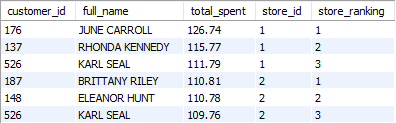
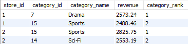

# Sakila SQL Project

A structured SQL practice project using the Sakila sample database to demonstrate query writing, data analysis, and relational database understanding.

---

## 📊 Project Overview
This project contains advanced analytical SQL queries built using the **Sakila sample database**.  
The goal is to demonstrate real-world business analysis skills using SQL, including revenue insights, customer behavior, ranking analysis, and store performance.
---

## 🧠 Skills Demonstrated
- Complex JOIN operations
- Aggregations & grouped analytics
- Window functions (RANK, DENSE_RANK, ROW_NUMBER)
- CTEs for modular query design
- Business KPI calculations
- Data storytelling with SQL

---

## Analysis Topics Covered
- Film distribution across categories
- Customer rental behavior
- Revenue patterns
- Store performance comparisons
- Popular actors and films

---

## 📌 Featured Queries

### 🥇 Top Customers per Store
Returns the 3 highest-spending customers for each store.

---

### 🎬 Top 2 Film Categories per Store by Revenue
Ranks film categories by total revenue within each store and returns the top two.

---

## 🚀 How to Run Queries
1. Import Sakila database  
2. Open MySQL Workbench (or any SQL client)  
3. Run queries from the `/queries` folder  

---

## 📈 Why This Project Matters
This project showcases **real analytical thinking**, not just SQL syntax.  
Each query answers a realistic business question such as:

- What generates the most revenue?
- Who are the most valuable customers?
- Which categories perform best per location?
---
